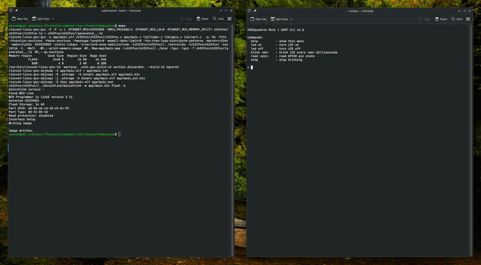
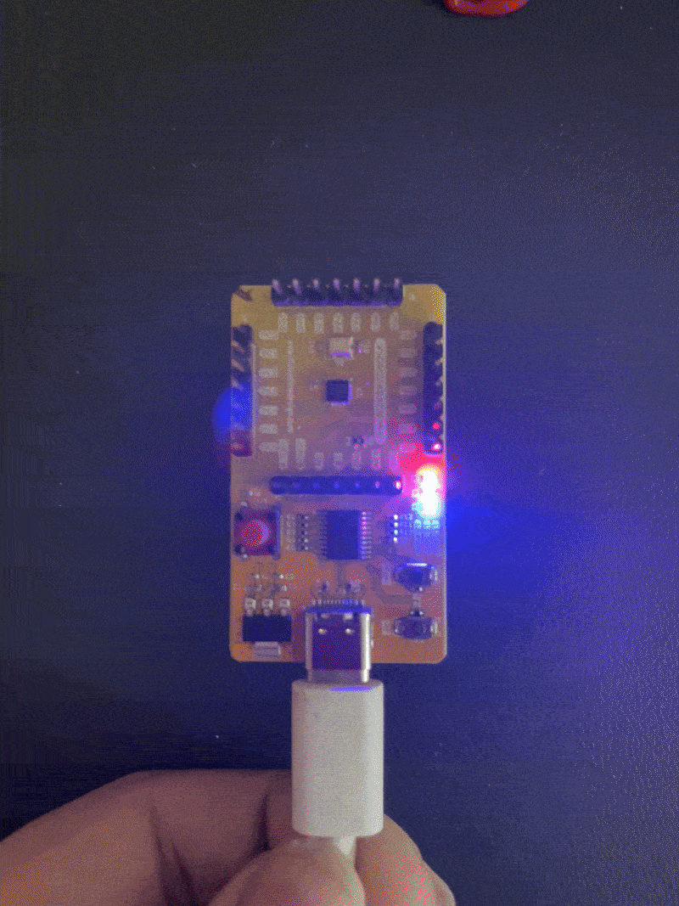

# VSDSquadron Mini Core
Bespoke firmware for the CH32V003F4U6 (RISC-V) on the VSDSquadron Mini board.

## Hardware

- MCU: CH32V003F4U6 (48MHz, 2KB SRAM, 16KB flash)
- Programmer: WCH-LinkE (onboard)
- UART bridge: WCH-LinkE via ttyACM0  

<br>


    
<p float="left">


</p>

## Build

```bash
make
make flash
```

## Monitor

```bash
screen /dev/ttyACM0 115200
```

## Toolchain

- xpack riscv-none-elf-gcc 13.2.0
- minichlink (from ch32v003fun)
