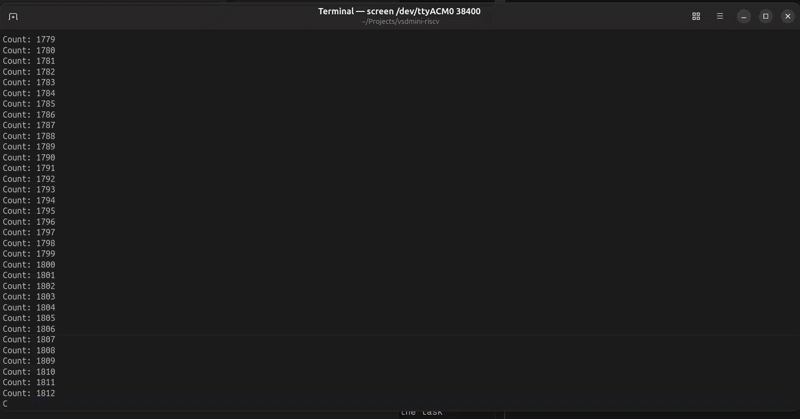

# Evidence Document
This document contains the video for final execution for Task 2. 

## UART Messages
---

## GPIO 
---
### Photo and video showing LED 
  Pin being toggled (LED) : [ PIN PD6 ]

  

### Mention: 
  - Physical Pin label: PD6 (verify on board silkscreen — look for "PD6" on the header row)
  - Firmware GPIO number: 6 (defined as `LED_PIN 6` in `gpio.h`)

## Verify correct behavior
---
Checklist before submission:
- [X] LED blinks at visible frequency (~1Hz)
- [X] UART terminal shows startup message: `VSDSquadron Mini | Firmware v1.0`
- [X] Counter increments every cycle: `Count: 0`, `Count: 1` ... (10+ lines)
- [X] UART monitored at 38400 baud on `/dev/ttyACM0`
- [X] Both LED and UART running simultaneously in the same firmware
