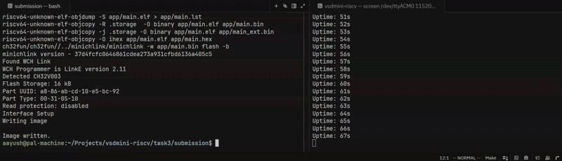
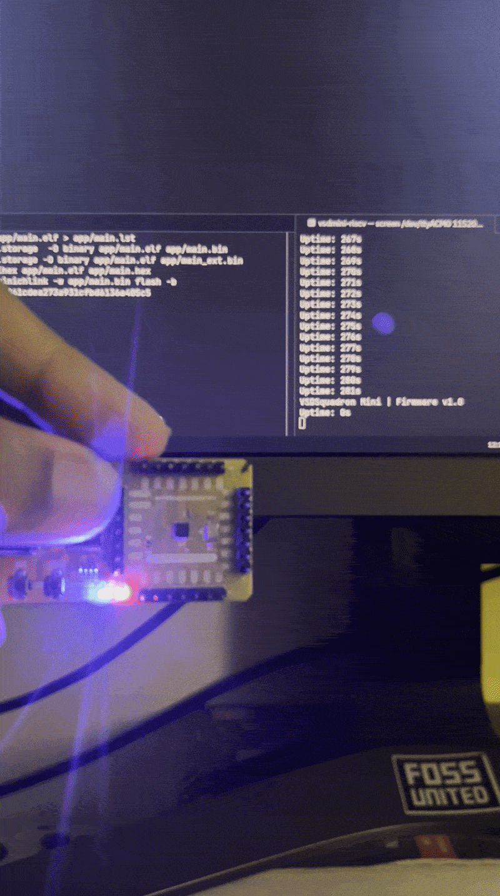

# Task 3 — Evidence

## 1. UART Evidence



Sample output observed on `/dev/ttyACM0` at 115200 baud:

```
VSDSquadron Mini | Firmware v1.0
Tick: 2
Tick: 1003
Tick: 2003
Tick: 3003
Tick: 4003
Tick: 5003
Tick: 6003
Tick: 7003
Tick: 8003
```

---

## 2. Hardware Evidence



---

## 3. Explanation

### How the application uses the library

`main.c` contains only application logic, no direct register access.

On startup:
- `gpio_init(6)` configures PD6 as push-pull output
- `uart_init()` configures USART1 on PD5 at 115200 baud
- `timer_init()` configures TIM2 with PSC=47, ARR=999 at 48MHz → 1ms tick, enables TIM2 interrupt in NVIC

Main loop:
- `gpio_toggle(6)` toggles the LED
- `get_tick()` reads elapsed milliseconds from the TIM2 interrupt-driven counter
- `uart_send_string()` + `uart_send_number()` prints the timestamp
- `delay_ms(1000)` waits 1 second before next iteration

### What was verified on hardware

- TIM2 interrupt fires every 1ms — confirmed by tick count incrementing correctly over UART
- LED toggles every 1 second — confirmed visually on PD6
- UART output streams continuously with accurate timestamps
- Firmware flashed successfully via WCH-LinkE using `minichlink`
